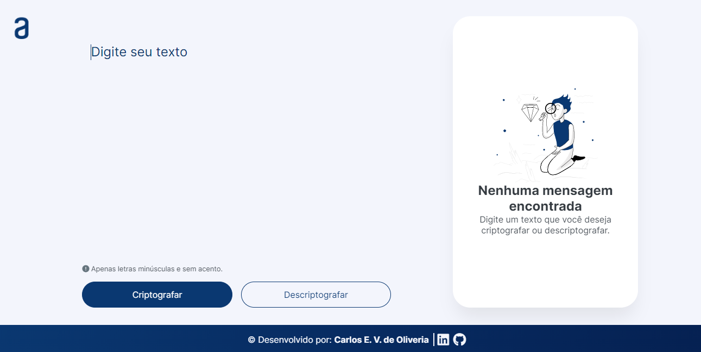

# Descodificador-de-texto
Challenge 01 Alura + Oracle

Simples aplicação que criptografa textos, assim você poderá trocar mensagens secretas com outras pessoas que saibam o segredo da 
criptografia utilizada.

As "chaves" de criptografia utilizadas são:
`A letra "e" é convertida para "enter"`
`A letra "i" é convertida para "imes"`
`A letra "a" é convertida para "ai"`
`A letra "o" é convertida para "ober"`
`A letra "u" é convertida para "ufat"`

**Requisitos:**
- Deve funcionar apenas com letras minúsculas
- Não devem ser utilizados letras com acentos nem caracteres especiais
- Deve ser possível converter uma palavra para a versão criptografada e também retornar uma palavra criptografada para a versão original. 

Por exemplo:
`"gato" => "gaitober"`
`gaitober" => "gato"`

- A página deve ter campos para inserção do texto a ser criptografado ou descriptografado, e a pessoa usuária deve poder escolher entre as duas opções
- O resultado deve ser exibido na tela.

**Extras:**
- Um botão que copie o texto criptografado/descriptografado para a área de transferência 
- ou seja, que tenha a mesma funcionalidade do `ctrl+C` ou da opção "copiar" do menu dos aplicativos.]

| :blue_book: Aplicação e Tecnológias |     |
| -------------  | --- |
| ::pencil2: Nome        | **Decodificador de texto**
| :label: Tecnologias | javascript, html, css
| :link: URL         | [https://carloseduardovdeoliveira.github.io/descodificador-de-texto/]
| :link: Figma         | https://www.figma.com/file/tvFEYhVfZTjdJ5P24RGV21/Alura-Challenge---Desafio-1---L%C3%B3gica?type=design&node-id=16-802&t=V25PfHpIIFiZLuBZ-0
| :bookmark_tabs: Trello         | https://trello.com/b/EmUFmjCv/decodificador-de-texto-alura-challenges-oracle-one
| :fire: Desafio     | https://www.alura.com.br/challenges/challenge-one-logica/sprint01-construa-decodificador-texto-com-javascript
